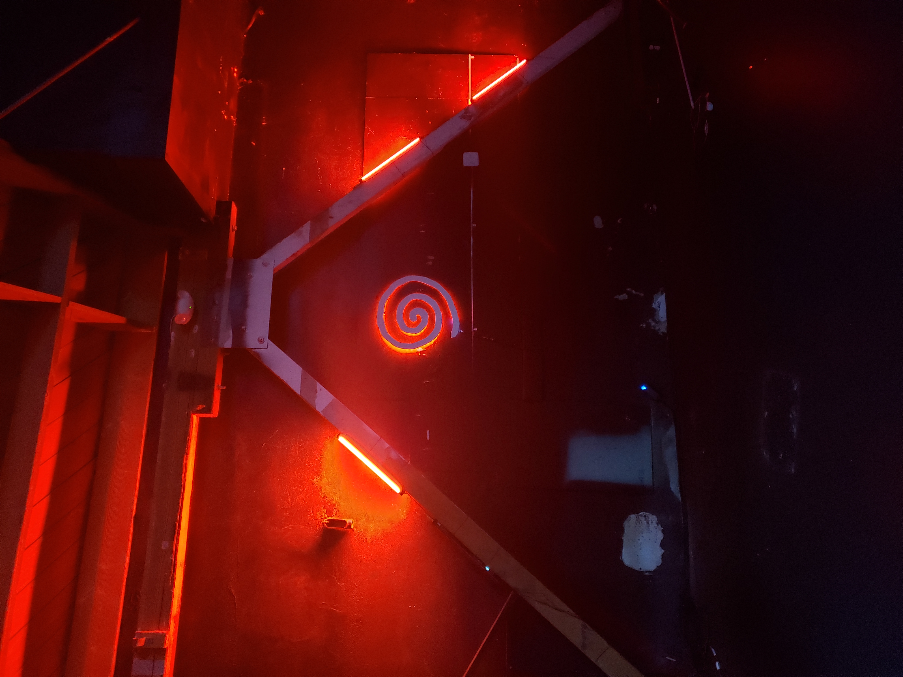
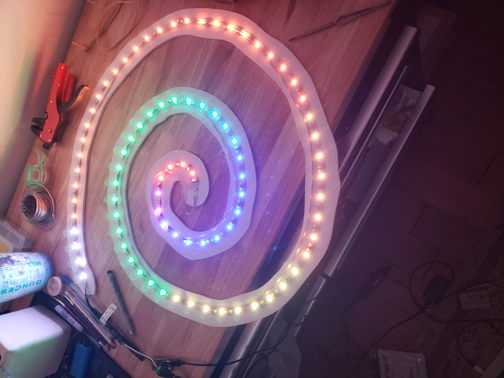

# Camp Flojo Logo Light

An ESP32-powered NeoPixel LED controller for the Camp Flojo spiral logo installation. Features a web-based control interface with multiple lighting effects, WiFi connectivity, and a responsive REST API.



## ✨ Features

- **Web-Based Control Panel** — Mobile-friendly interface served directly from the ESP32
- **Multiple Effects**
  - **Solid Color** — Set any RGB color with adjustable brightness
  - **Color Fade** — Smooth, randomized color transitions
  - **Snake** — Animated segment that travels along the spiral
  - **Off** — Power-saving mode
- **WiFi Connectivity** — Connects to your network or creates its own access point
- **REST API** — Programmatic control for integration with other systems
- **Adjustable LED Count** — Supports up to 144 addressable LEDs

## 🛠️ Hardware

- **Microcontroller:** ESP32 (DOIT DevKit V1)
- **LEDs:** WS2812B/NeoPixel addressable RGB LED strip
- **Data Pin:** GPIO 12

## 📸 Build Gallery

### LED Strip with Diffuser

The spiral uses a flexible LED strip mounted to a curved backing with a diffuser channel for smooth light output.


### Testing Effects

Color effects being tested during assembly, showing the rainbow fade and individual LED addressability.



## 🚀 Getting Started

### Prerequisites

- [PlatformIO](https://platformio.org/) (VS Code extension or CLI)
- ESP32 development board
- WS2812B LED strip

### Installation

1. **Clone the repository**

   ```bash
   git clone https://github.com/yourusername/camp-flojo-logo-light.git
   cd camp-flojo-logo-light
   ```

2. **Configure WiFi credentials** in `src/main.cpp`:

   ```cpp
   const char *WIFI_SSID = "YourNetworkName";
   const char *WIFI_PASSWORD = "YourPassword";
   ```

3. **Upload filesystem** (for the web UI):

   ```bash
   pio run --target uploadfs
   ```

4. **Upload firmware**:

   ```bash
   pio run --target upload
   ```

5. **Connect** to the ESP32's IP address in your browser (check Serial Monitor for the address)

### Fallback AP Mode

If the ESP32 can't connect to your WiFi network, it creates its own access point:

- **SSID:** `NeoPixel-Control`
- **Password:** `12345678`
- **URL:** `http://192.168.4.1`

## 🎛️ API Reference

### Get Current State

```
GET /api/state
```

**Response:**

```json
{
  "mode": "fade",
  "brightness": 160,
  "color": { "r": 255, "g": 80, "b": 10 },
  "count": 144,
  "ip": "192.168.1.100"
}
```

### Control Strip

```
GET /api/control?mode=solid&brightness=200&r=255&g=0&b=128&count=100
```

**Parameters:**
| Parameter | Type | Description |
|-----------|------|-------------|
| `mode` | string | `solid`, `fade`, `snake`, or `off` |
| `brightness` | int | 0-255 |
| `r`, `g`, `b` | int | RGB color values (0-255) |
| `count` | int | Number of active LEDs (1-144) |

## 📁 Project Structure

```
camp-flojo-logo-light/
├── src/
│   └── main.cpp          # Main firmware code
├── data/
│   ├── index.html        # Web control panel
│   └── style.css         # UI styling
├── platformio.ini        # PlatformIO configuration
└── README.md
```

## 📦 Dependencies

- [ESPAsyncWebServer](https://github.com/me-no-dev/ESPAsyncWebServer) — Async web server
- [NeoPixelBus](https://github.com/Makuna/NeoPixelBus) — LED strip driver with animations

## 📄 License

MIT License — Feel free to use this for your own camp installations!

---

_Built with 🔥 for Camp Flojo_
